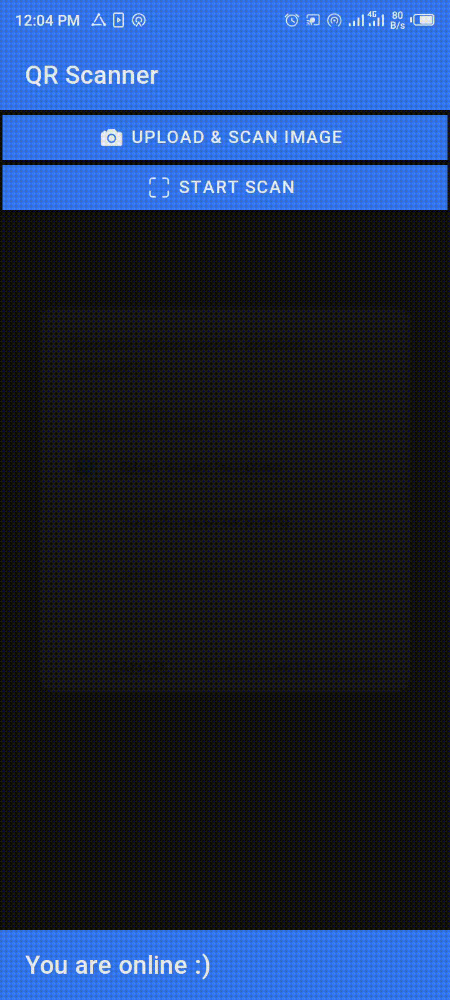
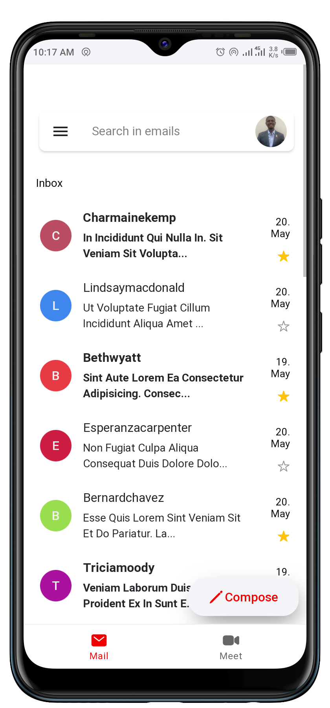

# Full-stack Web Developer 
## I'm a full-stack Web Developer in Machakos, Kenya. I learned to code after completing High School in 2019.

# Hello, I'm Karangu, let's talk!

Back before 2019, I was studying, playing computer games and endless streaming of movies, not knowing where I was going in life... Then I started this journey and haven't looked back! Now I'm in Machakos County, Kenya, studying Computer Science at Machakos University. Take a look at my skills,and some of my most recent projects below.

Ohh, before I forget here is a link to my portfolio:

Here is my [Portfolio](https://github.com/lwairore/portfolio):  https://karangulucaswairore.web.app/

# Full-stack Web Developer 
## Things I've learned:
### JavaScript, Python, HTML5, CSS3, Ionic, Angular, Django, and Flask
## Tools I use

- Visual Studio Code
- Github
- npm
- Git
- Chrome Developer Tools
- And more...

# Recent Web Projects:
These are all self-directed projects. You can find more work on my [Github](https://github.com/lwairore). Below are just some of my most recent works. Let me know if you have any questions!

## Angular QR Code Scanner

Built with: Angular, Ionic, and jsQR.

Angular QR Code Scanner implements:

- [jsQR](https://github.com/cozmo/jsQR) package to to read the image data of a stream (using an additional canvas) to grab any QR code that might be inside the image/frame.
- [MediaDevices Web API](https://developer.mozilla.org/en-US/docs/Web/API/MediaDevices/getUserMedia) to capture video using device camera.

### Summary
This is a simple QR Code scanner that you can install as a PWA.

[View demo](https://qr-code-skanner.web.app/) ∙ [View code](https://github.com/lwairore/angular-qr-code-scanner)

## Angular Gmeil Clone

### Summary
Angular Gmeil Clone is a simple similar clone of the popular Gmail.

Angular Gmeil Clone implements:

- The combination of a tab bar and side menu, plus the inbox UI known from Gmail.
- An animated 'Compose' button.
- A special behaviour to slide and delete emails with vibration haptic.
- Angular directive to create floating search bar which disappears when you scroll down, and comes back when you scroll in the opposite direction

[View demo](https://gmeil-clone.web.app/) ∙ [View code](https://github.com/lwairore/angular-gmeil-clone)

# Let's talk!
I'm always looking for opportunities. Contact me!

* [Github](https://github.com/lwairore)
* [LinkedIn](https://www.linkedin.com/in/lucas-wairore/)
* [Email](mailto:kwairore@gmail.com)

<!--
**lwairore/lwairore** is a ✨ _special_ ✨ repository because its `README.md` (this file) appears on your GitHub profile.

Here are some ideas to get you started:
//
- 🔭 I’m currently working on ...
- 🌱 I’m currently learning ...
- 👯 I’m looking to collaborate on ...
- 🤔 I’m looking for help with ...
- 💬 Ask me about ...
- 📫 How to reach me: ...
- 😄 Pronouns: ...
- ⚡ Fun fact: ...
-->
